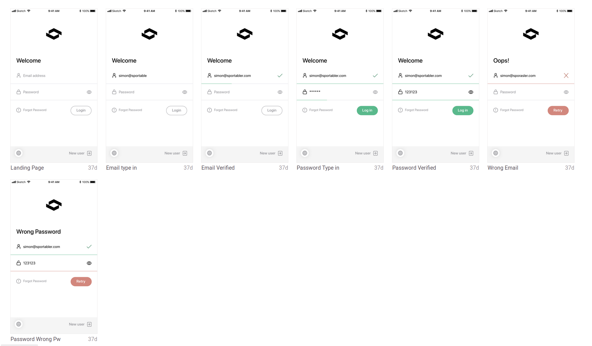

# Static html login form using tainwindcss

Static html Implementation of the design below

Uses vite, tailwindcss

## To develop

`npm i`

then 

`npm run dev`

## To build production

`npm run build`

## TODO

Add linter, prettier
Retry button
HTML Minifier

